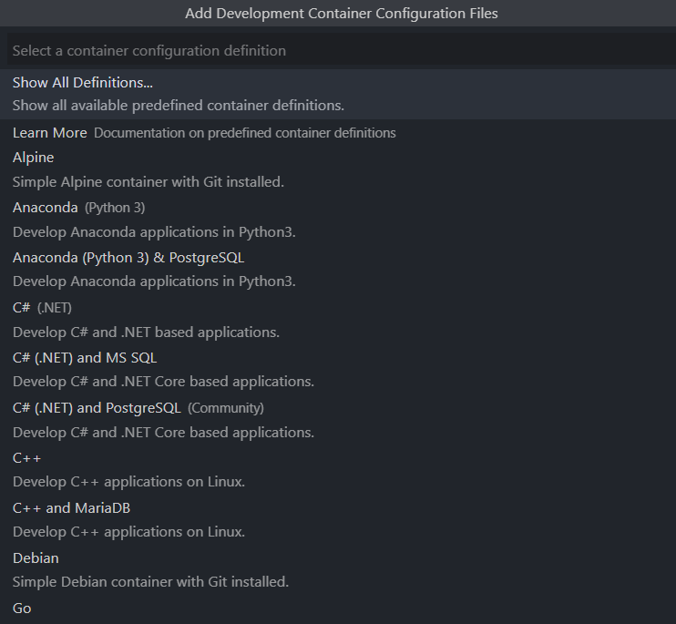
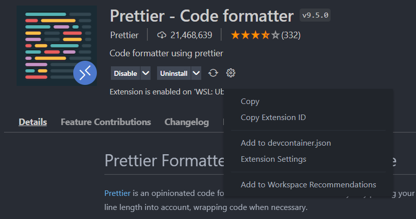
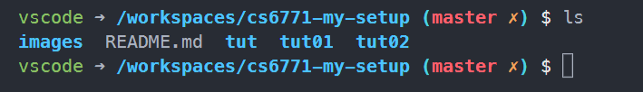
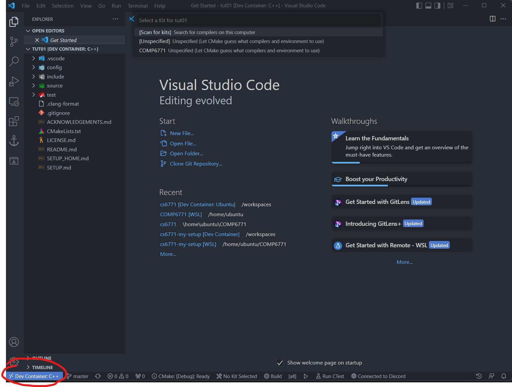
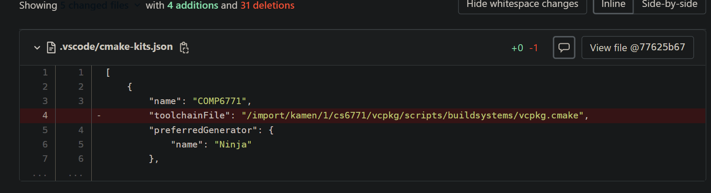

# 1. My Docker Dev Environment

# 2. Install Docker

- Install docker for your operating system.
- WSL may require more setup, but there are many guides.
  - WSL 2 only (probably)

# 3. Install VSCode Extension

Install the VSCode Remote Development extension [here](https://marketplace.visualstudio.com/items?itemName=ms-vscode-remote.remote-containers)

# 4. Remote Development Extension

Once installed, we can use the extension to setup a docker dev environment for CPP.

## 4.1. File Structure

You can build a separate container for each tutorial/repository, but that may take too much time and space. So, a workaround is to have a parent folder with each tutorial repository a a subfolder.

```
2511
  ->.devcontainer
  -> tut01
  -> tut02
  ...
```

In this example, I built the container in side the `2511` folder.

## 4.2. Building the Initial Container

1. Open the `2511` equivalent folder in VScode
2. `control + shift + p` or `command + shift + p` to open the command palette
3. Search for: `Remote-container: open folder in container`



4. Confirm the folder you want to open
5. Select C++ in the `Add Development Container Configuration Files`
6. Choose operating system. (I used `debian-11` as default)
7. Include whatever you whatever additional programs you want. You really only need `git`. Do note that they take time to install as they are compiled.
8. Chose the version of whatever you chose before (`latest` is fine for git)
9. It should start building the container now. It does take a while depending on your internet speed and computer performance.

Now you should have a new folder called `.devcontainer`. It contains 2 files, `devcontainer.json` and `Dockerfile`.

### 4.2.1. Inside the `devcontainer.json` file

The most important config in this file is the `extensions` array (a string of arrays). Any extensions added in here get automatically installed by vscode when you build the container.

I have added my own extensions, as seen in my file

```json
// For format details, see https://aka.ms/devcontainer.json. For config options, see the README at:
// https://github.com/microsoft/vscode-dev-containers/tree/v0.234.0/containers/cpp
{
  "name": "C++",
  "build": {
    "dockerfile": "Dockerfile",
    // Update 'VARIANT' to pick an Debian / Ubuntu OS version: debian-11, debian-10, ubuntu-22.04, ubuntu-20.04, ubuntu-18.04
    // Use Debian 11, Ubuntu 18.04 or Ubuntu 22.04 on local arm64/Apple Silicon
    "args": { "VARIANT": "debian-11" }
  },
  "runArgs": ["--cap-add=SYS_PTRACE", "--security-opt", "seccomp=unconfined"],

  // Set *default* container specific settings.json values on container create.
  "settings": {},

  // Add the IDs of extensions you want installed when the container is created.
  "extensions": [
    "eamodio.gitlens",
    "llvm-vs-code-extensions.vscode-clangd",
    "ms-vscode.cmake-tools",
    "twxs.cmake",
    "vadimcn.vscode-lldb",
    "webfreak.debug",
    "streetsidesoftware.code-spell-checker",
    "ExodiusStudios.comment-anchors",
    "donjayamanne.githistory",
    "shardulm94.trailing-spaces"
  ],

  // Use 'forwardPorts' to make a list of ports inside the container available locally.
  // "forwardPorts": [],

  // Use 'postCreateCommand' to run commands after the container is created.
  // "postCreateCommand": "gcc -v",

  // Comment out to connect as root instead. More info: https://aka.ms/vscode-remote/containers/non-root.
  "remoteUser": "vscode",
  "features": {
    "git": "latest"
  }
}
```

#### 4.2.1.1. How to find extension id strings

1. Go onto any vscode extensions via the extensions section.
2. Click the settings cog wheel
3. Click copy extension id
4. Paste extension id into the array as a string



### 4.2.2. `Dockerfile`

The Dockerfile basically contains all the information needed to build the image. We can add extra commands that runs whilst building the image.

We can edit the Dockerfile by adding the following lines to the end of the `.devcontainer/Dockerfile`.

```Dockerfile
# Updates system
RUN apt-get update
RUN apt-get dist-upgrade -y
RUN apt-get install -y curl gnupg wget software-properties-common
RUN apt-get update

# Installs non-LLVM tools
RUN apt-get install -y \
    build-essential \
    bzip2           \
    cmake           \
    gcc-10          \
    g++-10          \
    gdb             \
    git             \
    gzip            \
    ninja-build     \
    openssh-server  \
    sed             \
    tar             \
    unzip           \
    zip             \
    zlib1g

# Install LLVM
RUN wget https://apt.llvm.org/llvm.sh
RUN chmod +x llvm.sh
RUN ./llvm.sh 11
RUN apt-get install -y  \
    clang-tidy-11    \
    libc++-11-dev    \
    libc++abi-11-dev \
    python3-clang-11

RUN apt-get remove -y software-properties-common
RUN apt-get dist-upgrade -y
RUN apt-get autoremove -y
```

Now, whenever we build the image, it will install & update all the packages we need.

**Alternatively**, you can not edit the Dockerfile and just run the `setup_home.md` commands.

## 4.3. Rebuilding Container

Because we have edited the config files and the Dockerfile, rebuild the image.

1. `control + shift + p` or `command + shift + p` to open the command palette
2. Search for: `Remote-container: Rebuild Container`

Now, docker should rebuild the image & install all the linux packages we need & also installing our vscode extensions.

It will also take more time.

# 5. Using terminal to open another directory

Using the terminal inside vscode, we can see that we are in a terminal inside the docker environment.



You can open another folder in vscode my using `code foldername`.

For example, if I wanted to open my tut01 folder I would use `code tut01`.



Note how in the bottom left it says `Dev Container: C++` where `C++` is the name of the container found in `devcontainer.json`

That completes the setup. cmake should work properly in this environment.

# 6. Making Sure your `.vscode` config files are correct

Ensure that you have gotten the latest MR/PR on GitLab. If not, confirm you don't have this troublesome line in your `.vscode/cmake-kits.json`


